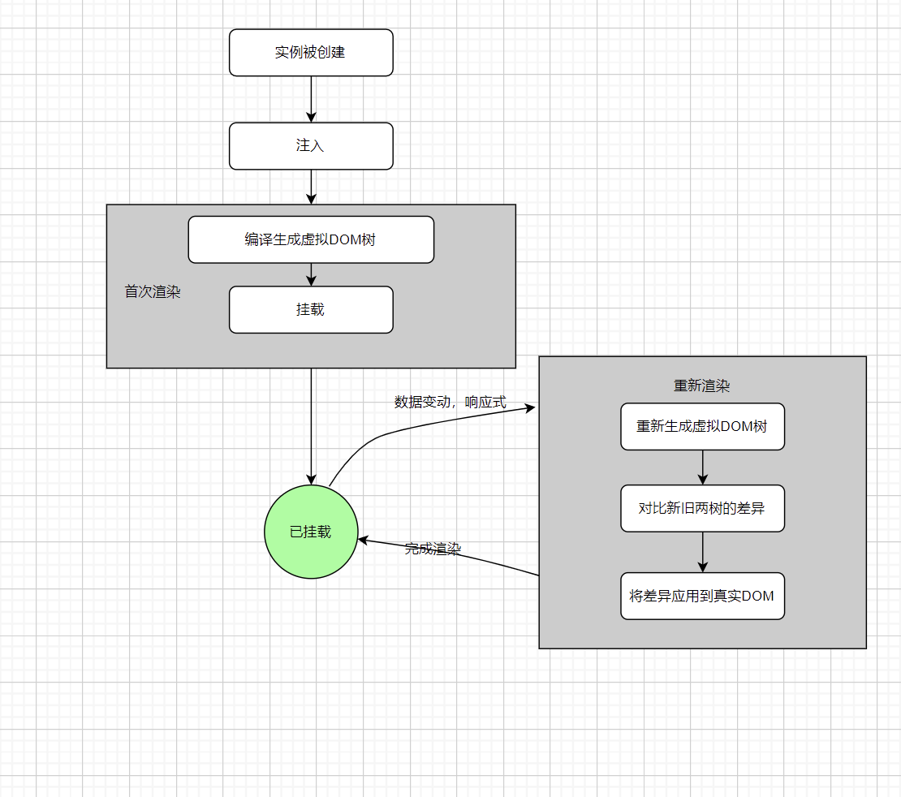
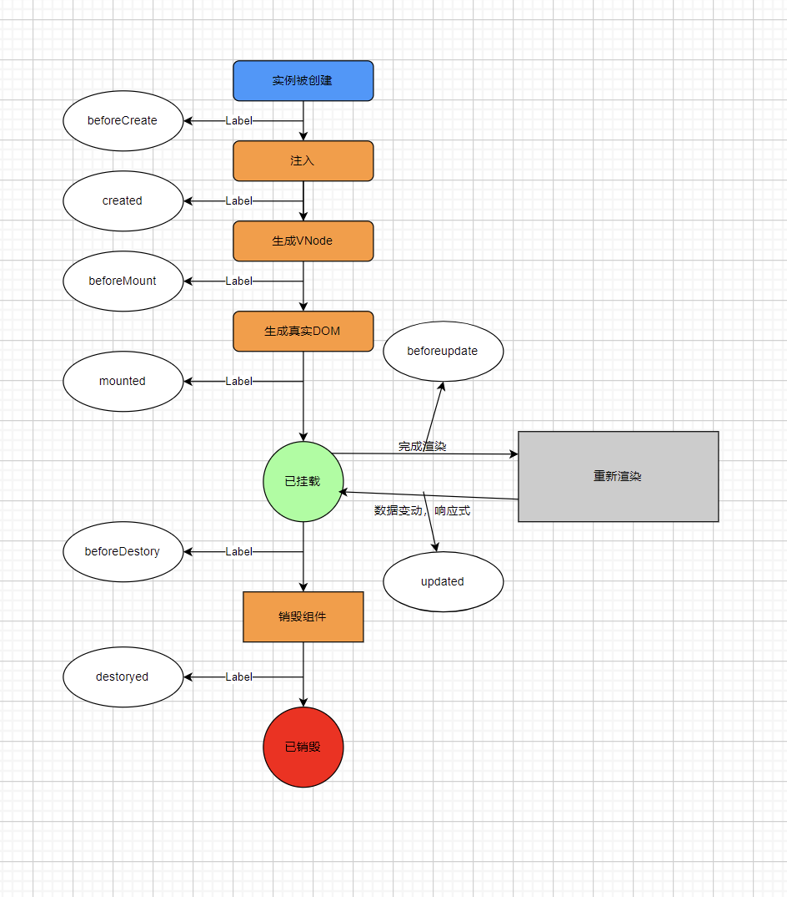

## 组件生命周期




## hooks 钩子函数

vue实例的详细生命周期
   


## 常见应用

加载远程数据：
```js
export default {
    data(){
        return {
            news:[]
        }
    },
    async created(){
        this.news = await getNews();
    }
}
```

直接操作dom
```js
export default {
    data() {
        return {
            containerWidth:0,
            containerHeight:0
        }
    },
    mounted(){
        this.containerWidth = this.$refs.container.clientWidth;
        this.containerHeight = this.$refs.container.clientHeight;
    }
}
```

启动和清除计时器
```js
    export default {
        data() {
            return {
                timer:null
            }
        },
        created(){
            this.timer = setInterval(()=>{
                ...
            },1000)
        },
    }
```